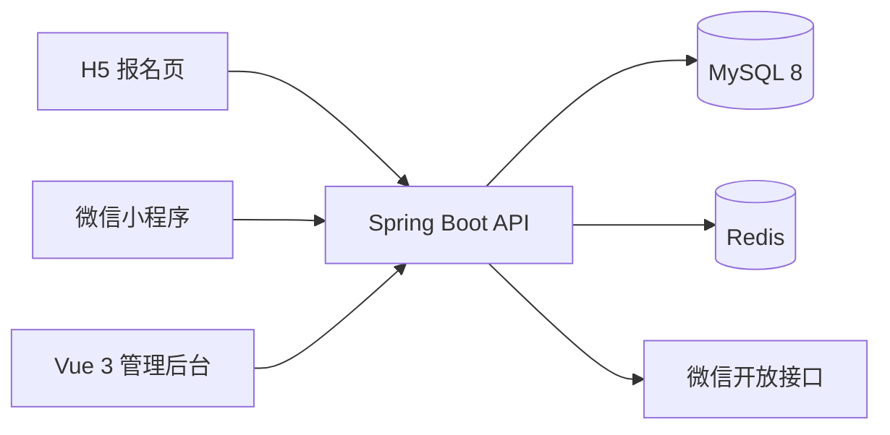

# 健步同行 - 多端健步走活动管理平台

基于 Spring Boot 3 与 Vue 3 构建的线上健步走活动平台，覆盖 H5 报名、微信小程序打卡和后台运营管理。系统支持活动配置、报名审核、微信步数同步、积分排名、异常数据处理、奖励管理及细粒度权限控制。

## 项目亮点

- **完整业务闭环**：覆盖活动创建、会员报名、审核、步数同步、积分结算、排名和奖励发放。
- **多端协同**：同一套后端同时服务 Vue 3 管理后台、uni-app 微信小程序和 H5 报名页。
- **积分排名引擎**：按每日目标、连续达标和全勤规则计算积分，支持个人与单位维度统计。
- **异常数据治理**：识别超限或异常步数，提供标记、恢复、删除、批量处理和审计追踪。
- **细粒度权限**：基于 Sa-Token、动态菜单和权限码实现角色、按钮及管理员个人权限控制。
- **数据一致性**：使用 Redis 管理会话、榜单缓存和并发控制，关键操作保留审核日志。

## 系统架构



## 功能模块

| 模块 | 主要功能 |
| --- | --- |
| 活动管理 | 活动周期、报名时间、每日目标和积分规则配置 |
| 报名管理 | H5 报名、自动/人工审核、取消、撤下和单位调整 |
| 会员管理 | 会员资料、组织归属、账号状态和打卡明细 |
| 步数与积分 | 微信运动同步、达标计算、积分明细和排行榜 |
| 数据统计 | 参与率、达标率、个人排名和单位统计 |
| 异常处理 | 异常步数识别、批量处置、恢复和审计日志 |
| 奖励管理 | 奖励档位、中奖名单生成、调整和导出 |
| 权限管理 | 固定管理员身份、动态菜单、按钮和个人权限覆盖 |

## 技术栈

| 层级 | 技术 |
| --- | --- |
| 后端 | Java 17、Spring Boot 3、MyBatis-Plus、Sa-Token |
| 数据 | MySQL 8、Redis、Redisson |
| 管理后台 | Vue 3、TypeScript、Vite、Element Plus、Pinia |
| 微信小程序 | uni-app、Vue 3、SCSS |
| H5 | HTML、CSS、JavaScript |
| 工程化 | Maven、pnpm、Docker、Nginx |

## 项目结构

```text
.
├── RuoYi-Vue-Plus-5.6.0/   # Spring Boot 后端，walking 为核心业务模块
├── plus-ui-6.X-Vue/         # Vue 3 后台管理端
├── jianbu-app/              # uni-app 微信小程序
├── jianbu-h5/               # H5 报名页
└── jianbu-docs/             # 设计文档、业务规则与 SQL 脚本
```

## 快速开始

### 环境要求

- JDK 17
- Maven 3.8+
- MySQL 8
- Redis 6+
- Node.js 18+ 与 pnpm
- HBuilderX、微信开发者工具（运行小程序时需要）

### 1. 初始化数据库

创建数据库 `ry-vue`，先导入若依基础脚本：

```bash
mysql -u root -p ry-vue < RuoYi-Vue-Plus-5.6.0/script/sql/ry_vue_5.X.sql
```

再按顺序导入业务脚本：

```text
jianbu-docs/sql/walking_tables.sql
jianbu-docs/sql/walking_admin_menu.sql
jianbu-docs/sql/walking_org.sql
jianbu-docs/sql/walking_config_award.sql
jianbu-docs/sql/walking_award_config.sql
jianbu-docs/sql/fix_admin_permission_defects.sql
```

### 2. 配置环境变量

```bash
MYSQL_USERNAME=root
MYSQL_PASSWORD=your_mysql_password
REDIS_PASSWORD=your_redis_password
WX_APPID=your_wechat_appid
WX_SECRET=your_wechat_secret
```

### 3. 启动后端

```bash
cd RuoYi-Vue-Plus-5.6.0
mvn -Pdev -DskipTests package
java -jar ruoyi-admin/target/ruoyi-admin.jar
```

后端默认地址：`http://localhost:8080`

### 4. 启动管理后台

```bash
cd plus-ui-6.X-Vue
pnpm install
pnpm dev
```

管理后台默认地址：`http://localhost:5173`

### 5. 运行其他客户端

- H5：在 `jianbu-h5` 目录启动任意静态文件服务。
- 小程序：使用 HBuilderX 打开 `jianbu-app`，运行到微信开发者工具。

## 文档

- [核心业务规则](jianbu-docs/00-核心业务规则汇总.md)
- [接口设计](jianbu-docs/03-接口设计.md)
- [开发设计](jianbu-docs/04-开发设计.md)
- [部署文档](jianbu-docs/05-部署文档.md)
- [积分与排名规则](jianbu-docs/07-积分与排名规则.md)
- [总体设计文档](jianbu-docs/10-总体设计文档.md)

## 安全说明

数据库密码、Redis 密码、微信 AppID 和 AppSecret 均应通过环境变量或外部配置注入，不要将真实凭据提交到仓库。生产环境应启用 HTTPS、接口加密，并限制数据库和 Redis 的网络访问范围。

## License

本项目基于 RuoYi-Vue-Plus 与 plus-ui 开发，相关开源组件遵循其原有许可证。
